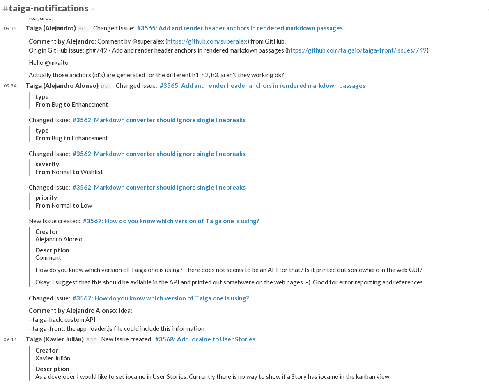

Tuesmon contrib slack
===================

[](https://github.com/kaleidos "Kaleidos Project")
[](https://manage.tuesmon.com/project/tuesmon/ "Managed with Tuesmon.com")

The Tuesmon plugin for slack integration.



Installation
------------
### Production env

#### Tuesmon Back

In your Tuesmon back python virtualenv install the pip package `tuesmon-contrib-slack` with:

```bash
  pip install tuesmon-contrib-slack
```

Modify in `tuesmon-back` your `settings/local.py` and include the line:

```python
  INSTALLED_APPS += ["tuesmon_contrib_slack"]
```

Then run the migrations to generate the new need table:

```bash
  python manage.py migrate tuesmon_contrib_slack
```

#### Tuesmon Front

Download in your `dist/plugins/` directory of Tuesmon front the `tuesmon-contrib-slack` compiled code (you need subversion in your system):

```bash
  cd dist/
  mkdir -p plugins
  cd plugins
  svn export "https://github.com/tuesmoncom/tuesmon-contrib-slack/tags/$(pip show tuesmon-contrib-slack | awk '/^Version: /{print $2}')/front/dist" "slack"
```

Include in your `dist/conf.json` in the `contribPlugins` list the value `"/plugins/slack/slack.json"`:

```json
...
    "contribPlugins": [
        (...)
        "/plugins/slack/slack.json"
    ]
...
```

### Dev env

#### Tuesmon Back

Clone the repo and

```bash
  cd tuesmon-contrib-slack/back
  workon tuesmon
  pip install -e .
```

Modify in `tuesmon-back` your `settings/local.py` and include the line:

```python
  INSTALLED_APPS += ["tuesmon_contrib_slack"]
```

Then run the migrations to generate the new need table:

```bash
  python manage.py migrate tuesmon_contrib_slack
```

#### Tuesmon Front

After clone the repo link `dist` in `tuesmon-front` plugins directory:

```bash
  cd tuesmon-front/dist
  mkdir -p plugins
  cd plugins
  ln -s ../../../tuesmon-Contrib-slack/front/dist slack
```

Include in your `dist/conf.json` in the `contribPlugins` list the value `"/plugins/slack/slack.json"`:

```json
...
    "contribPlugins": [
        (...)
        "/plugins/slack/slack.json"
    ]
...
```

In the plugin source dir `tuesmon-contrib-slack/front` run

```bash
npm install
```
and use:

- `gulp` to regenerate the source and watch for changes.
- `gulp build` to only regenerate the source.


How to use
----------

Follow the instructions on our support page [Tuesmon.com Support > Contrib Plugins > Slack integration](https://manage.tuesmon.com/support/contrib-plugins/slack-integration/ "Tuesmon.com Support > Contrib Plugins > Slack integration")
